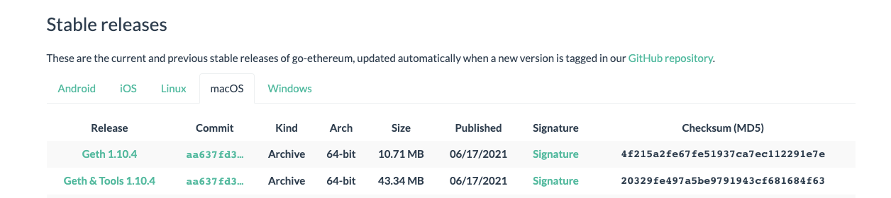
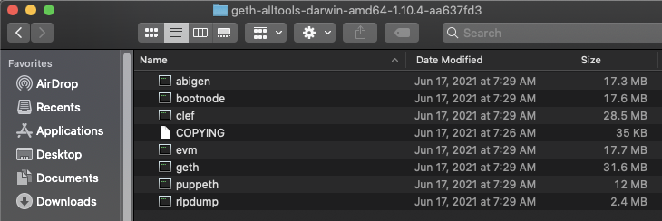
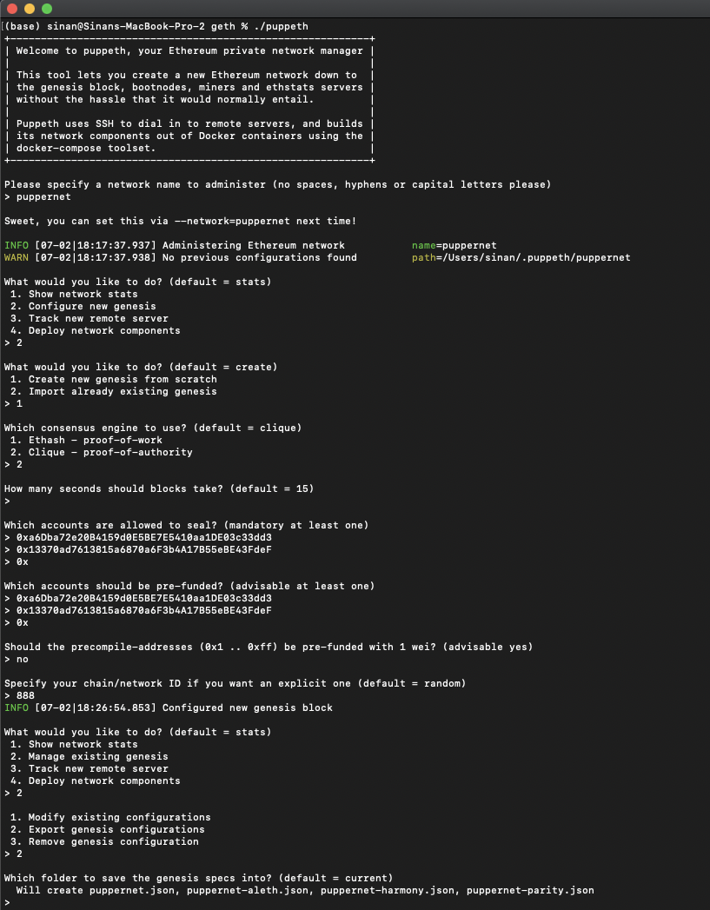
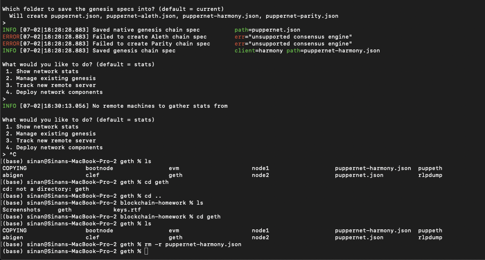
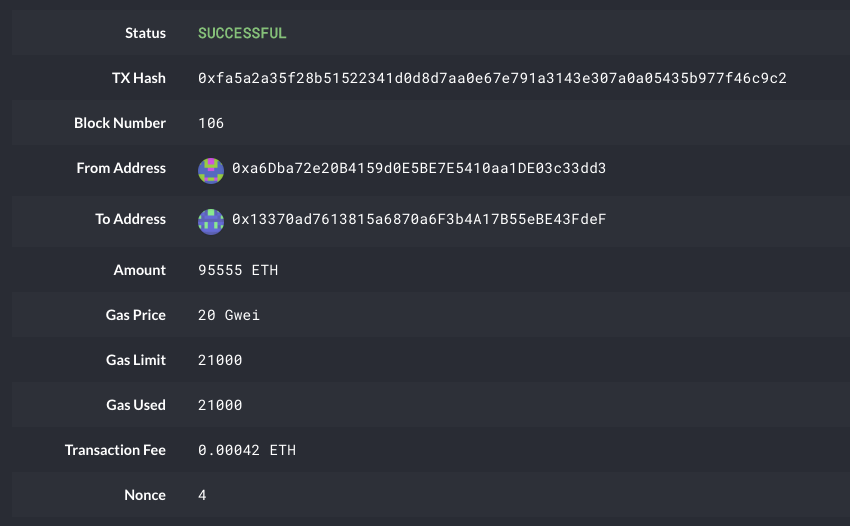

# Blockchain Building Blocks

### Ethereum network steps

1) Go to https://geth.ethereum.org/downloads/ and download the latest version of Geth & Tools.


2) Unpack the downloaded zipped folder and copy the contents of the folder to a desired working folder.



3) Open terminal and browse to the working folder with the geth & tools.

4) Create accounts for two nodes for the network with a separate datadir for each.

```bash
./geth account new --datadir node1
./geth account new --datadir node2
```

5) Run puppeth, name the network puppernet, and select the option to configure a new genesis block. Follow the same steps as below.






6) With the genesis block creation completed, we will now initialize the nodes with the genesis' json file. 

    Using geth, initialize each node with the new puppernet.json.

```bash
./geth init puppernet.json --datadir node1
./geth init puppernet.json --datadir node2
```

7) Now the nodes can be used to begin mining blocks.

    Run the nodes in separate terminal windows with the commands:
    
- Node 1:

```bash
./geth --datadir node1 --unlock "a6dba72e20b4159d0e5be7e5410aa1de03c33dd3" --mine --rpc --allow-insecure-unlock
```

- Node 2 in a separate terminal window
    

```bash
./geth --datadir node2 --unlock "13370ad7613815a6870a6f3b4a17b55ebe43fdef" --mine --port 30304 --bootnodes "enode://d3fe5bea6704b4305f593eecd15678cf9882f44ffb83e5d8cf34c2a236d3847727fd4b7f00b32a87711b5299e31de49701c532847197f74c0ff9edee93c44df4@127.0.0.1:30303" --ipcdisable --allow-insecure-unlock
```

8) To be continued...

