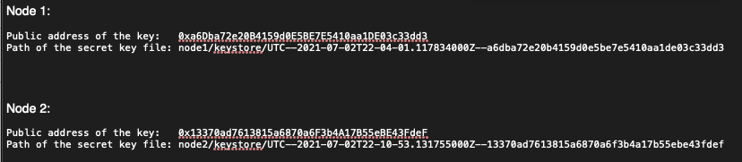
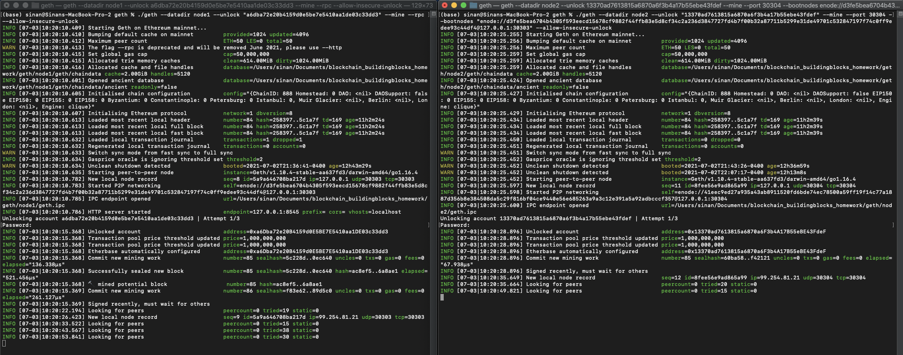
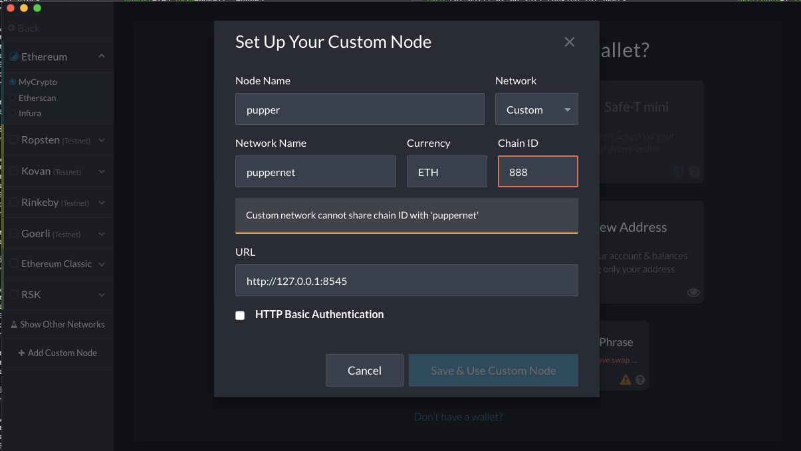

# Private ethereum chain setup via GETH

### Ethereum network setup steps

1) Go to https://geth.ethereum.org/downloads/ and download the latest version of Geth & Tools.


2) Unpack the downloaded zipped folder and copy the contents of the folder to a desired working folder.


3) Open terminal and browse to the working folder with the geth & tools.

4) Create accounts for two nodes for the network with a separate datadir for each.

```bash
./geth account new --datadir node1
./geth account new --datadir node2
```


5) Run puppeth, name the network puppernet, and select the option to configure a new genesis block. Follow the same steps as below.


- Chain/Network Id is set to 888
- Block time is set to the default 15 seconds. 
- Block time explained: https://medium.facilelogin.com/the-mystery-behind-block-time-63351e35603a

6) With the genesis block creation completed, we will now initialize the nodes with the genesis' json file. 

    Using geth, initialize each node with the new puppernet.json.

```bash
./geth init puppernet.json --datadir node1
./geth init puppernet.json --datadir node2
```

7) Now the nodes can be used to begin mining blocks.

    Run the nodes in separate terminal windows with the commands:
    
- Node 1:

```bash
./geth --datadir node1 --unlock "a6dba72e20b4159d0e5be7e5410aa1de03c33dd3" --mine --rpc --allow-insecure-unlock
```

- Node 2 in a separate terminal window:
    

```bash
./geth --datadir node2 --unlock "13370ad7613815a6870a6f3b4a17b55ebe43fdef" --mine --port 30304 --bootnodes "enode://d3fe5bea6704b4305f593eecd15678cf9882f44ffb83e5d8cf34c2a236d3847727fd4b7f00b32a87711b5299e31de49701c532847197f74c0ff9edee93c44df4@127.0.0.1:30303" --ipcdisable --allow-insecure-unlock
```

- The --rpc flag enables us to talk to our second node, which will allow us to use MyCrypto or Metamask to transact on our chain.


- Since the first node's sync port already took up 30303, we need to change this one to 30304 using --port.


- The --bootnodes flag allows you to pass the network info needed to find other nodes in the blockchain. This will allow us to connect both of our nodes.

- In Microsoft Windows, we need to add the flag --ipcdisable due to the way Windows spawns new IPC/Unix sockets doesn't allow for having multiple sockets running from geth at once. Since we are only using RCP we can safely disable the IPC sockets.



8) MyCrypto connection setup to local network. Network was previously setup before taking the screenshot, please ignore the displayed warning messages.



9) Click the play button below to open the video that shows steps taken to connect to the local puppernet network and send a transaction between nodes.

<a href="https://drive.google.com/file/d/1GdTLWNsgL_y94klDzEVKgUGUi8IL5az_/view" title="Link Title"></a>

10) End Result:


